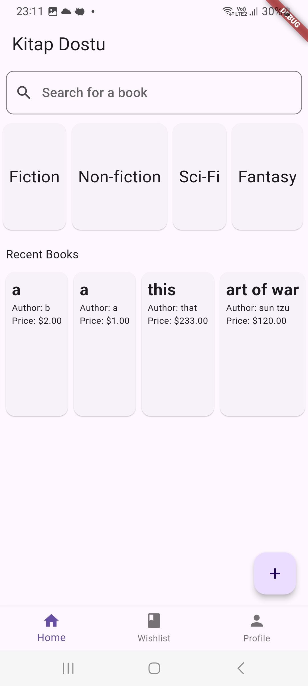

## Takım Üyeleri
- ***Ahmad Rashid Sadeed*** - Scrum Master
- ***Ali Emir Özen*** - Product Owner
- ***Ayşe Özkan*** - Developer
- ***Ayşegül Dal*** - Developer

## Uygulama İsmi
Kitap Dostu

## Uygulama Açıklaması
Kitap severlerin okudukları kitapların ikinci okurlarını bulmaya yönelik yapılmış bir uygulama. Kullanıcılar
okudukları kitapları satış/bağış ilanına koyabilir. aynı zamanda almak istedikleri bir kitabı da arayabilir.

## Özellikleri
- Konuma göre kitap araştırma imkanı vardır
- Açık kaynak

## Hedef Kitle
- Ağır kitap okurları
- Öğrenciler
- Kitap kolleksiyon sahipleri

---
# **SPRINT 1**
- **Daily Scrum**: Whatsapp üzerinden görüşmeler sağlanmıştır.
  
- **Tasarım ve Developing Mantığı**: Tasarım tarafı aynı zamanda developing kısmında da çalışacaktır. Tasarım yapılırken aynı zamanda yazılıma uygulanmıştır.

- **Ürün Durumu**: Ekran Görüntüleri:

  **Sprint Review**:
- Genel uygulama mantığı oluşturulmuştur
- Uygulamanın genel UI iskeleti oluşturulmuş.

---
# **SPRINT 2**
- **Daily Scrum**: veri erişimi konusu üzerinde tartışıldı.

- **Tasarım ve Developing Mantığı**: veritabanı, users ve books olmak üzere, iki farklı kolleksyon barındırıyor. book kolleksiyonunda her kitabın detayları
 bulunmakta ve bu kitaplara kullanıcılar tarafından  her kitabın UIDsini kullanarak erişilebiliniyor.

- **Ürün Durumu**: Ekran Görüntüleri:

  **Sprint Review**:
- veri tabanı ve veri erişim mantığı geliştirilmiştir.

  **Sprint Retrospective:**
- daha dinamik ve professyonel bir çalışma etiği geliştirme gereği duyuluyor.

