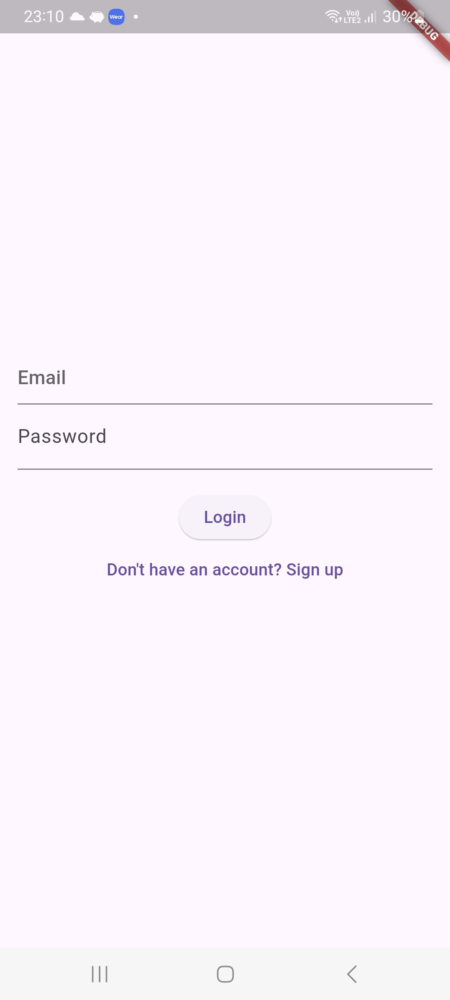
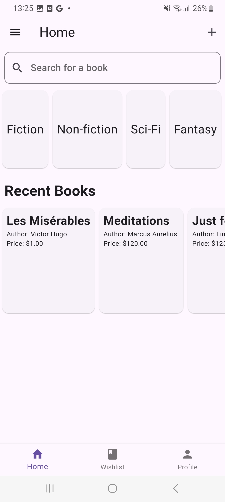
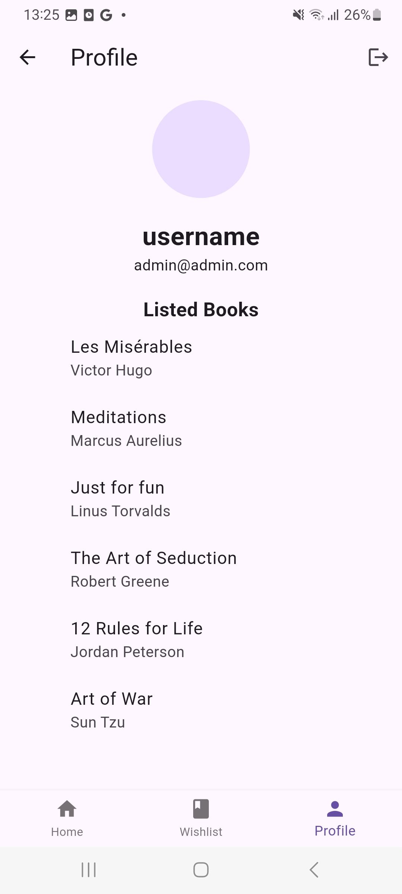
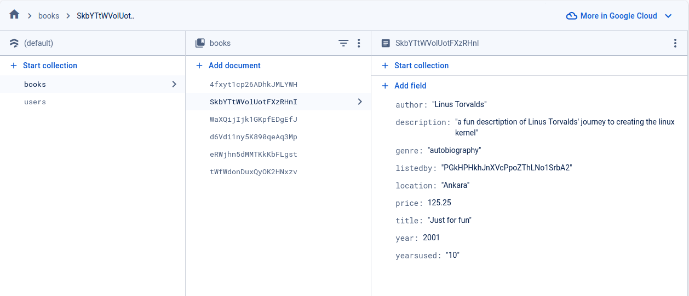
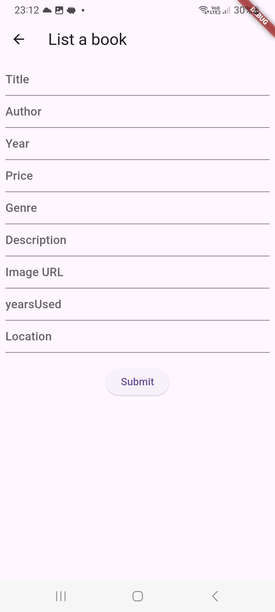
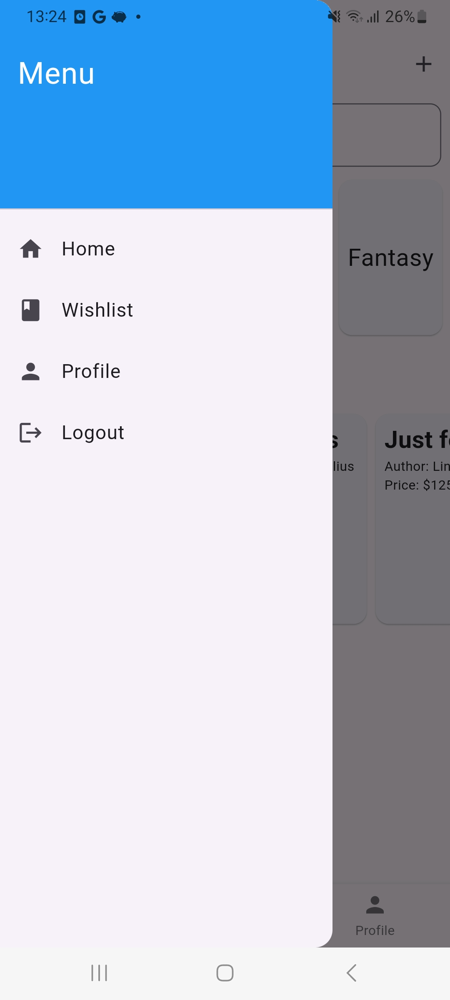

## Takım Üyeleri
- ***Ahmad Rashid Sadeed*** - Scrum Master
- ***Ali Emir Özen*** - Product Owner
- ***Ayşe Özkan*** - Developer
- ***Ayşegül Dal*** - Developer

## Uygulama İsmi
Kitap Dostu

## Uygulama Açıklaması
Kitap severlerin okudukları kitapların ikinci okurlarını bulmaya yönelik yapılmış bir uygulama. Kullanıcılar
okudukları kitapları satış/bağış ilanına koyabilir. aynı zamanda almak istedikleri bir kitabı da arayabilir.

## Özellikleri
- Konuma göre kitap araştırma imkanı vardır
- Açık kaynak

## Hedef Kitle
- Ağır kitap okurları
- Öğrenciler
- Kitap kolleksiyon sahipleri

---
# **SPRINT 1**
- **Daily Scrum**: Whatsapp üzerinden görüşmeler sağlanmıştır.
  
## - **Tasarım ve Developing Mantığı**:
Tasarım tarafı aynı zamanda developing kısmında da çalışacaktır. Tasarım yapılırken aynı zamanda yazılıma uygulanmıştır.
 

## - **Ürün Durumu**: Ekran Görüntüleri:

 ## **Sprint Review**:
- Genel uygulama mantığı oluşturulmuştur
- Uygulamanın genel UI iskeleti oluşturulmuş.

---
# **SPRINT 2**
## - **Sprint Notlari**:
veri erişimi konusu üzerinde tartışıldı. veri tabanının tasarımı ve verilere erişim mantığı üzerine calışma yapıldı

Scrun metodları kullanılarak iş bölümü ve teslim tarihine göre zamanlama yapıldı

- **Daily scrum**
  Zamansal sorunlarından dolayı whatsapp üzerinden yapılmıştır

## - **Tasarım ve Developing Mantığı**:
veritabanı, users ve books olmak üzere, iki farklı kolleksyon barındırıyor. book kolleksiyonunda her kitabın detayları
 bulunmakta ve bu kitaplara kullanıcılar tarafından  her kitabın UIDsini kullanarak erişilebiliniyor.

##  **Ürün Durumu**: Ekran Görüntüleri:

  ## **Sprint Review**:

  **Kararlar**
- veri tabanı ve veri erişim mantığı geliştirilmiştir. ürünlerin ve kullanıcıların bilgilerini barındıracak iki farklı
  kolleksiyon oluşturulmasına karar verildi.
- kolleksiyonlar arasındaki iletişim için her "document"in özel UID'sinin kullanılmasına karalaşılmıştır.

  ## **Sprint Retrospective:**
- daha dinamik ve professyonel bir çalışma etiği geliştirme gereği duyuluyor.

---
# **SPRINT 3**
## - **Sprint Notlari**:
Yeni kullanicilarin hesap kurmalari icin sign-up ekrani ve uygulama icindeki fonksyonlar tartışıldı

- **Daily scrum**
  Zamansal sorunlarından dolayı whatsapp üzerinden yapılmıştır

## - **Tasarım ve Developing Mantığı**:
sign-up ekranı ayrı bir screen olarak yapılandırldı ve sign-in ekranına bağlandı. 
uygulama içerisinda, kitap ekleme, logout, vb., veritabanıyal iletişim kurmayı gerektiren fonksyonlar ve butonlar
geliştirildi ve uygulandı. kitap eklenmesi içinde ayrı bir ekran tasarlandı. 

##  **Ürün Durumu**: Ekran Görüntüleri:

  ## **Sprint Review**:

  **Sonuçlar**
- yeni üye girişi için sign-up ekranı yapıldı.
- kitap eklemek için buton ve ekran tasarlandı.
- çıkış yapmak için sign up ekranı yapıldı.
- yukarıdakilerin hepsi için gerekli veritabanı iletişimleri de sağlandı.
- uygulama çalışır hale getirilmiş. imzalanıp apk'sı üretilmiştir

  ## **Sprint Retrospective:**
- bootkamp süreci hakkında konuşuldu ve ilerdeki projelerde izlenmesi gereken
profesyonel yol tartışıldı.

